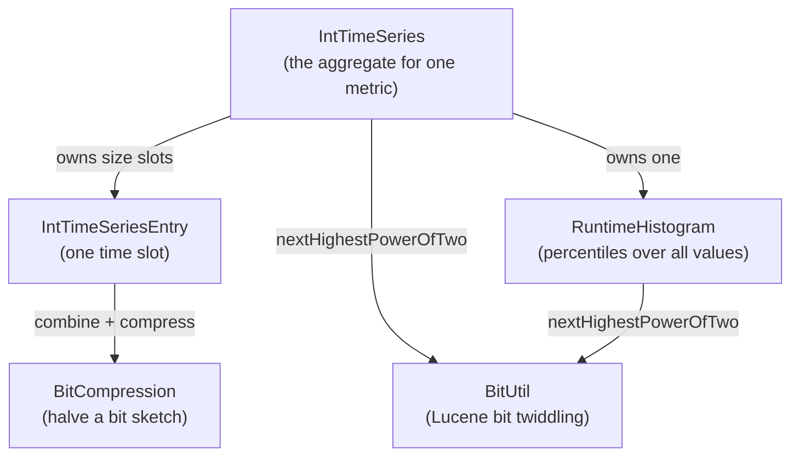
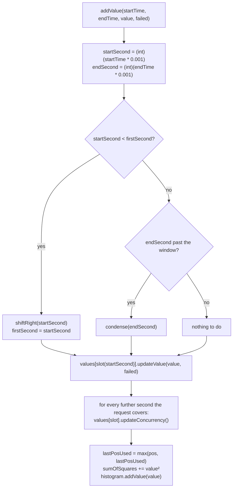

# XLT Report Data Structures — Architecture Notes

Scope: everything under `src/main/java/com/xceptance/xlt/report/util/` in this module.

Status: **descriptive**. This document says what the code *is* and why, including the parts
that are broken. What it *should become* is in [XLT-DATA.md](XLT-DATA.md).

---

## 1. Where this code comes from and what it is for

These classes are lifted out of **XLT** (Xceptance LoadTest), a load and performance testing
tool. They belong to the *report generator*: the part that runs after a load test and turns
the raw timer files into charts and tables.

That origin explains every design decision in here. A load test run produces one measurement
record per request, per action and per transaction. A mid-sized run produces tens of millions
of records, a large one produces billions. The report generator has to turn those into
per-second charts, percentiles, histograms and summary tables — on a normal machine, in
bounded memory, in a single pass over the data.

So the guiding rule of this package is:

> **No sample is ever stored.** Everything is a counter, a bit sketch or a fixed-size array,
> and the resolution degrades on demand instead of the memory growing.

Anything that looks odd in this code usually follows from that rule. The pieces that are
genuinely wrong rather than merely lossy are listed in §9.

The package name `rework` and the comment in `IntTimeSeriesEntry` ("This was
`LowPrecisionIntValueSet` before. We moved it here for less memory consumption and better
performance.") mark this as an in-progress redesign of older XLT classes, not as settled code.

---

## 2. The five classes and how they fit together



| Class | Package | Role | Lines |
|---|---|---|---|
| `IntTimeSeries` | `…util.rework` | The entry point. A fixed-size, self-scaling series of per-second buckets for one measured metric. | 501 |
| `IntTimeSeriesEntry` | `…util.rework` | One time slot: exact statistics plus a lossy sketch of the distinct values seen. | 381 |
| `RuntimeHistogram` | `…util` | A counting histogram over `int` values; the source of all percentiles. | 337 |
| `BitCompression` | `…util.misc` | Two bit operations that halve the resolution of a 64-bit sketch. | 57 |
| `BitUtil` | `…util.lucene` | Imported from Apache Lucene/Solr. Population counts, trailing/leading zero counts, power-of-two helpers. | 839 |

**`BitUtil` is 90% dead weight in this module.** Of its fifteen public methods (plus two public
lookup tables) only `nextHighestPowerOfTwo(int)` is called, twice — once by `IntTimeSeries` to round the slot count
up, once by `RuntimeHistogram` to round the precision up. The `pop_*` family, `ntz*` and `nlz`
have no caller here. They are tested anyway (they are on the classpath and could be used), but
do not go looking for the architectural reason they exist — there is none beyond "the file was
copied whole".

---

## 3. The one idea you must understand: two independent resolution ladders

The package trades **resolution for memory** in two completely separate places. They use the
same trick — halve everything, remember how often you halved — but they scale along different
axes and never talk to each other.

| | Time ladder | Value ladder |
|---|---|---|
| Lives in | `IntTimeSeries.scale` | `IntTimeSeriesEntry.distinctValuesScale` |
| Buckets | `size` slots (a power of two, default 4096) | 128 buckets (two `long`s) |
| Bucket unit | seconds per slot | value units per bucket |
| Halves when | a time stamp arrives past the end of the window | a value arrives that does not fit into 128 buckets |
| Halving primitive | `IntTimeSeriesEntry.merge` of neighbouring slots | `BitCompression.combine` + `compress` |
| One-way? | yes, never gets finer again | yes, never gets finer again |
| Reported by | `getScale()` / `getSlotWidth()` | implicitly, through `getValues()` |

### 3.1 The off-by-one in `scale`

`IntTimeSeries.scale` starts at **1**, not 0, and the slot width is `1 << (scale - 1)`. So:

| `getScale()` | `getSlotWidth()` | meaning |
|---|---|---|
| 1 | 1 | one second per slot |
| 2 | 2 | two seconds per slot |
| 3 | 4 | four seconds per slot |
| 9 | 256 | four minutes per slot |

`IntTimeSeriesEntry.distinctValuesScale` on the other hand starts at **0** and the bucket width
is `1 << scale`. Same concept, different base. Mixing the two up is the single easiest mistake
to make in this code, and the production code makes it once (§9, D7).

---

## 4. `IntTimeSeries` — the time window

### 4.1 State

```java
int   firstSecond;   // the second that slot 0 starts at; DEFAULT (2_147_385_000) until the first value
int   lastPosUsed;   // highest slot index touched so far; -1 until the first value
int   scale;         // exponent + 1; slot width is 1 << (scale - 1)
int   size;          // slot count, rounded up to a power of two
IntTimeSeriesEntry[] values;      // size slots, all pre-allocated, never null
RuntimeHistogram     histogram;   // every value, at precision 8, for percentiles
double               sumOfSquares;// for the standard deviation
```

The slot for a second is

```java
slot = (second - firstSecond) >> (scale - 1);
```

and the window the series currently covers is

```java
[firstSecond, firstSecond + size * slotWidth)
```

`DEFAULT = 2_147_385_000` is a sentinel meaning "no data yet", chosen so that the first real
time stamp is always smaller and therefore takes the shift branch. It is **2038-01-17**, not
2037-12-31 as the comment claims — a harmless discrepancy, but it is the kind of thing that
makes you doubt the rest of the file.

### 4.2 What `addValue` does



Three things about this flow are worth remembering:

1. **The window check is in an `else if`.** A value that shifts the window left is never checked
   against the right-hand end. That is not a style detail, it is defect D3.
2. **The sample is booked on its start second only.** The `count`, the sum, the min and the max
   all land in the slot of `startSecond`. The seconds in between only get their *concurrency*
   counter bumped. So `count` answers "how many requests started here" and `concurrentCount`
   answers "how many requests were in flight here".
3. **The histogram sees the raw value**, the slot sees the value clamped at zero. Percentiles and
   min/max therefore come from two slightly different populations (§9, D18).

### 4.3 Condensing — making time coarser

Triggered when a time stamp does not fit into the right-hand end of the window.

```
before (slot width w)      [ 0 ][ 1 ][ 2 ][ 3 ][ 4 ][ 5 ][ 6 ][ 7 ]
merge neighbours           [0+1][2+3][4+5][6+7][ - ][ - ][ - ][ - ]
after  (slot width 2w)     [ 0 ][ 1 ][ 2 ][ 3 ][new][new][new][new]
```

Each round doubles the covered time span, so a series can absorb an arbitrarily long test run
in a fixed amount of memory. The round is repeated until the new time stamp fits. The merge of
two neighbouring slots is `IntTimeSeriesEntry.merge`, which makes that method the pivot of the
whole design — everything the entry cannot merge correctly is lost here.

The loop that drives this is where the worst defects live (D1). Read `condense` together with
§9 before you touch it.

### 4.4 Shifting — accepting out-of-order data

Report generation reads many timer files, one per agent, and merges them; the time stamps
therefore do **not** arrive sorted. When a value arrives before `firstSecond`, the whole slot
array is `System.arraycopy`d to the right by the number of slots the window has to grow, the
freed slots at the front are replaced by fresh entries, and `firstSecond` moves back.

If the shift would push live data off the right-hand end, `condense` is called first to make
room. That is the theory. In practice this path is where the second family of defects lives
(D2), and the arithmetic uses `(firstSecond >> s) - (second >> s)` where it means
`(firstSecond - second) >> s`, which are not the same number.

### 4.5 Derived statistics

| Method | How it is computed | Cost |
|---|---|---|
| `getCount`, `getTotalValue`, `getErrorCount`, `getStatistics` | full scan over all slots | O(size) **per call** |
| `getMean`, `getStandardDeviation` | full scan, then arithmetic | O(size) per call |
| `getPercentile(p)` | delegated to the `RuntimeHistogram` | O(buckets) |
| `toHistogram(n)` | full scan for min/max, then `n` range queries against the `RuntimeHistogram` | O(size + buckets) |

Nothing is cached. `getMean()` followed by `getStandardDeviation()` scans 4096 slots twice.
The standard deviation is the *population* sigma computed as `sqrt(E[x²] - E[x]²)`, the
numerically unstable form, from a `sumOfSquares` that is accumulated with `Math.pow(value, 2)`.

---

## 5. `IntTimeSeriesEntry` — one time slot

64 bytes flat (measured with JOL, 64-bit HotSpot, compressed oops), no references, no arrays:

```
 0  8  object header (mark)
 8  4  object header (class)
12  4  int  count                 how many samples started in this slot
16  8  long totalValue            sum of the samples, for the average
24  8  long distinctValuesLow     value sketch, buckets 0..63
32  8  long distinctValuesHigh    value sketch, buckets 64..127
40  4  int  concurrentCount       how many requests were in flight in this slot
44  4  int  errorCount            how many of the samples failed
48  4  int  maximum
52  4  int  minimum
56  4  int  distinctValuesScale   how often the sketch has been halved
60  4  (alignment gap)
```

A default `IntTimeSeries` is 4096 of these plus the array: **≈272 KB per metric**, whatever the
number of samples.

### 5.1 The value sketch

128 bits in two `long`s. Bit *i* means "at least one value fell into bucket *i*". Bucket *i*
covers `[i << scale, (i+1) << scale)`, and `getValues()` reports the **floor** of each populated
bucket.

```
scale 0   bucket i covers exactly the value i        values 0..127 are exact
scale 1   bucket i covers 2i .. 2i+1                 values 0..255
scale 2   bucket i covers 4i .. 4i+3                 values 0..511
…
scale 24  bucket i covers 16M values                 up to Integer.MAX_VALUE
```

When a value ≥ `128 << scale` arrives, the sketch is halved: neighbouring buckets are ORed
together and the scale goes up by one. The halving is `BitCompression.combineAdjacentBits`
followed by `compressAndShiftOddBits`, which together map bit *b* to bit *b/2* — and, crucially,
always leave their result in the **lower 32 bits**. Folding the compressed high word back into
the upper half of the low word is the caller's job:

```java
low  = compress(combine(low));          // buckets 0..63  -> 0..31
high = compress(combine(high));         // buckets 64..127 -> 0..31, must become 32..63
low  = low | (high << 32);              // <- this line is the whole trick
high = 0;
```

`scaleIfNeeded` does exactly this. `merge` does **not** (D4).

### 5.2 Guarantees of the sketch

* A reported value is never larger than a value that was actually added.
* A reported value is never more than one bucket width below the value that produced it.
* The number of reported values is bounded by 128 and by the number of samples.
* Duplicates collapse; the sketch says nothing about frequency. Frequencies come from the
  `RuntimeHistogram`, not from here.

### 5.3 `merge` is the condense primitive

`a.merge(b)` folds `b` into `a` and returns `a`. Sums add up, min/max combine, error counts add
up — and **the concurrency is the maximum, not the sum**, because two slots that are merged
represent overlapping wall-clock time, not disjoint request sets.

`merge` also has to bring both sketches to a common scale, and it **mutates its argument** to
get there: `coarse.merge(fine)` rescales `fine` in place. The javadoc warns about it. It is
still a trap, and it makes `equals` non-reflexive over time (a merge argument stops being equal
to a freshly built copy of itself).

`equals` compares all nine fields. There is **no `hashCode`**.

---

## 6. `RuntimeHistogram` — where percentiles come from

A counting histogram with a dense, sliding bucket window:

```java
int[] countPerBucket;   // one counter per bucket, no gaps
int   firstIndexValue;  // bucket index of countPerBucket[0]
int   lastIndexValue;   // bucket index of the last element
int   precision;        // a SHIFT, not a width; getPrecision() returns 1 << precision
int   valueCount;
```

* `bucketIndex = value >> precision`, so a precision of 8 puts values 0..7 into one bucket.
* The requested precision is rounded up to a power of two, then converted to a shift.
* The array grows **in both directions**: a smaller value than seen before reallocates and
  shifts everything right, a larger one reallocates and appends.
* `IntTimeSeries` constructs it with `new RuntimeHistogram(8)`, so every percentile that comes
  out of a time series is rounded down to a multiple of 8.

### 6.1 The percentile definition

The empirical quantile from the German Wikipedia article the code links to:

```
np = n * p / 100
np integral      ->  mean of the np-th and the (np+1)-th value in order
otherwise        ->  the ceil(np)-th value in order
```

with `p = 0` and `p = 100` short-circuited to the smallest and the largest populated bucket.
Every result is a **bucket floor**, so `getPercentile(100)` returns the floor of the bucket that
holds the maximum, not the maximum.

### 6.2 The memory characteristic you have to know

Memory is proportional to the **spread** of the values, not to their number:

| data | buckets | array |
|---|---|---|
| 100 000 values in a range of 10 | 10 | 40 bytes |
| 2 values: 0 and 1 000 000 (precision 8) | 125 001 | 488 KB |

A single outlier is enough to blow up the array: the size is `(max - min) / precision * 4`
bytes, no matter how few samples produced it. One request that runs into a 20-minute timeout
costs 586 KB in that metric's histogram at precision 8, and 4.6 MB at the default precision of
1. This is the biggest *operational* risk in the package, and there is no guard against it.

---

## 7. `BitCompression` and `BitUtil`

`BitCompression` has exactly two operations, and they are only ever used as a pair (§5.1):

| Method | Effect |
|---|---|
| `combineAdjacentBits(v)` | `v \| (v << 1)` — smears every set bit into the next higher position |
| `compressAndShiftOddBits(v)` | packs the odd bits 1,3,5,… into positions 0,1,2,… of the lower 32 bits |

Composed, they map bucket `2k` and bucket `2k+1` onto bucket `k` — a lossy OR, never an
invention and never a loss of a populated bucket.

`BitUtil` is stock Lucene. The parts to know:

* `nextHighestPowerOfTwo(v)` is the only method with a caller. It returns **0 for 0 and for
  negative input**, and it overflows to `Integer.MIN_VALUE` above 2^30. Both callers pass the
  result straight into an array allocation without checking (§9, D12).
* `isPowerOfTwo(v)` is `v & (v-1) == 0`, so it answers `true` for 0 and for `Integer.MIN_VALUE`.
* `ntz3(0)` returns 63, not 64 — the implementation has no branch left to tell "bit 63 is set"
  from "nothing is set". `ntz` and `ntz2` handle zero correctly.
* The `pop_*` family processes eight words per iteration through a carry-save-adder network and
  then handles the remaining words in a 4/2/1 cascade. The word *count* alone decides which code
  path runs, which is why the tests sweep the length instead of sampling it.

---

## 8. Invariants

Things that hold today and that a change must not break:

1. `values.length == size` and `size` is a power of two.
2. No slot is ever `null`; all slots are allocated in the constructor and replaced, never
   nulled.
3. `scale` and `distinctValuesScale` never decrease.
4. `slotWidth == 1 << (scale - 1)` and is always a power of two.
5. A sample is booked on exactly one slot; only the concurrency counter is spread over several.
6. `concurrentCount >= count` within a slot.
7. The value sketch never reports a value above the maximum that was added.
8. `RuntimeHistogram`: the bucket counters sum to `valueCount` — always, including after growth
   in either direction.
9. `IntTimeSeries.getFirstSecond()` / `getLastSecond()` throw `IllegalStateException` while the
   series is empty, and never afterwards.

Invariants 1–8 are covered by the test suite. Invariant 9 is covered for the empty case only,
because the series can lose all its data without going back to the empty state (D1).

---

## 9. Defects you must know before changing anything

Full write-up, severity and proposed fixes: [XLT-DATA.md](XLT-DATA.md). Short list:

| # | Where | What happens | Test |
|---|---|---|---|
| D1 | `IntTimeSeries.condense` | A forward gap of `size²` seconds or more **silently drops everything recorded so far**. | `IntTimeSeriesTest` T36–T38 |
| D2 | `IntTimeSeries.shiftRight` | A backward gap of more than `2 × size + 1` seconds throws `ArrayIndexOutOfBoundsException` out of `addValue`. | T40–T42 |
| D3 | `IntTimeSeries.addValue` | A request longer than the window throws, because the overflow check sits in the `else` of the shift check. | T52 |
| D4 | `IntTimeSeriesEntry.merge` | The rescale forgets to fold the high word into the low word; buckets ≥ 64 are reported at ~1.6× their real value. | `IntTimeSeriesEntryTest` T33 |
| D5 | `IntTimeSeries.toHistogram` | Throws `IllegalArgumentException` for a flat series (min == max) and for more buckets than the value range. | T43, T44 |
| D6 | `IntTimeSeries.toHistogram` | Bucket counts overlap; they sum to more than the number of samples (100 samples → 132). | T45 |
| D7 | `IntTimeSeries.addValue` | The concurrency loop steps by `scale` where it means `slotWidth`. | T51 |
| D8 | `IntTimeSeries` | `sumOfSquares` uses the raw value and survives data loss, so sigma contradicts count and mean. | T39 |
| D9 | `IntTimeSeriesEntry.merge` | Mutates its argument. | T27, T30 |
| D10 | `IntTimeSeries.getValues` | Hands out the live slot array. | T47 |
| D11 | `IntTimeSeriesEntry` | `equals` without `hashCode`. | T31 |
| D12 | both constructors | Size 0, negative sizes and sizes above 2^30 are not rejected. | T48–T50 |
| D13 | `RuntimeHistogram` | Memory is proportional to the value spread; one outlier can exhaust the heap. | T29 |

---

## 10. The test suite as documentation

`src/test/java/com/xceptance/…` mirrors the production packages, one test class per production
class, each split into lettered sections.

| Test class | Sections |
|---|---|
| `BitUtilTest` | A pop, B pop\_array family, C ntz/nlz, D power-of-two helpers |
| `BitCompressionTest` | A combine, B compress, C the composed round, D class shape |
| `RuntimeHistogramTest` | A construction, B growth, C percentiles, D range counts, **E quirks** |
| `IntTimeSeriesEntryTest` | A construction, B exact statistics, C value sketch, D merge, **E contract and defects** |
| `IntTimeSeriesTest` | A construction, B adding, C concurrency, D condensing, E shifting, F statistics, **G defects** |

Tests whose display name starts with `DEFECT` pin **current, wrong** behaviour on purpose, so
that a fix produces a visible diff instead of silently changing report numbers. Every one of
them is referenced from the defect table above and from the proposal.

Run them:

```bash
mvn -pl demo6 test
```

---

## 11. Glossary

| Term | Meaning here |
|---|---|
| **slot** | one bucket of a time series, `slotWidth` seconds wide |
| **scale** | how often something has been halved; `IntTimeSeries` counts from 1, `IntTimeSeriesEntry` from 0 |
| **condense** | halve the time resolution by merging neighbouring slots |
| **shift** | move the window to the left to accept an earlier time stamp |
| **sketch** | the 128-bit set of distinct values in an entry |
| **precision** | `RuntimeHistogram`: the bucket width, stored as a shift |
| **count vs. concurrent count** | requests *started* in a slot vs. requests *in flight* during a slot |
| **failed** | a sample flagged as an error; it still contributes to sum, min and max |
