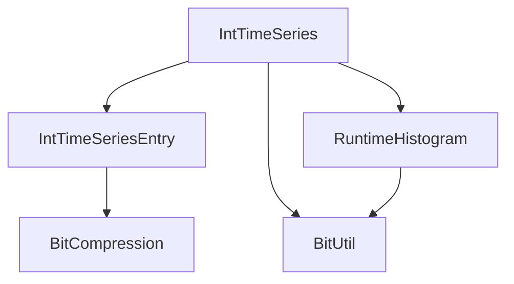
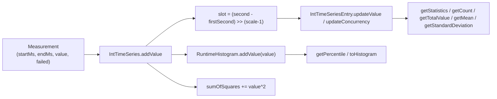

# XLT Report Data Aggregation — Architecture & Knowledge Base

This document extracts the architectural knowledge needed to understand the
`com.xceptance` code in `demo7`. It describes what the code does, how the
pieces fit together, which algorithms and invariants they rely on, which
assumptions they make, and which defects/quirks a maintainer must know about.
Everything stated here about defects has been verified empirically (see
section 10).

> Scope: `demo7/src/main/java/com/xceptance/**` and its tests in
> `demo7/src/test/java/com/xceptance/**`. The `org.jugsaxony.demo7` hash-map
> code is a separate demo and is documented in `FastHashMap-spec.md`.

---

## 1. Purpose and Context

The classes are report-side **streaming aggregation utilities** in the spirit
of XLT (Xceptance Load Test) result processing. During a load test, millions
of timer measurements are produced. Each measurement is essentially:

- a start timestamp (epoch millis),
- an end timestamp (epoch millis),
- an `int` runtime value (typically millis),
- a `failed` flag.

Storing all raw measurements is impossible memory-wise for long-running
report aggregation. These classes therefore implement **bounded-memory,
single-pass aggregation**:

- per-second (later per-slot) min/max/sum/count/error/concurrency statistics,
- a coarse approximation of the distinct value distribution per slot,
- global percentiles via a counting histogram,
- mean and standard deviation.

The central design promise: **the time period covered is unbounded, the memory
is not.** When the covered time range outgrows the fixed slot array, the
resolution is halved (slots are merged) instead of dropping data or growing.

## 2. Package and Class Map

```
com.xceptance.xlt.report.util
├── RuntimeHistogram              counting histogram -> percentiles/quantiles
├── lucene
│   └── BitUtil                   bit twiddling (popcount, ntz/nlz, pow2)
├── misc
│   └── BitCompression            adjacent-bit join + odd-bit compression
└── rework
    ├── IntTimeSeries             fixed-size time-slot statistics container
    └── IntTimeSeriesEntry        per-slot aggregate (min/max/sum/count/...)
```

| Class | Role | Instantiated by |
|---|---|---|
| `IntTimeSeries` | Top-level container. Maps timestamps to slots, manages window shifting and resolution condensing, owns the global histogram and sum-of-squares. | Report processing code, one per measured metric/transaction name. |
| `IntTimeSeriesEntry` | One time slot. Exact aggregates (count, sum, min, max, errors, concurrency) + a lossy 128-bucket distinct-value approximation. Mergeable. | `IntTimeSeries` pre-allocates one per slot. |
| `RuntimeHistogram` | Counts occurrences per value bucket (bucket width = `precision`, a power of two). Grows its bucket array on demand to the left and right. Computes empirical percentiles/quantiles. | `IntTimeSeries` (hard-wired with precision 8). |
| `BitCompression` | Two static helpers implementing "join adjacent buckets" on a 64-bit word. | `IntTimeSeriesEntry` scaling and merging. |
| `BitUtil` | Static bit utilities: popcount family, trailing/leading zero counts, power-of-two helpers. Vendored from Apache Solr/Lucene (`org.apache.solr.util` rev 555343). | `IntTimeSeries` (size rounding), `RuntimeHistogram` (precision rounding). |

### Dependency graph



There are no cycles. `BitUtil` and `BitCompression` are leaf utilities with
private constructors (static-only classes).

## 3. Data Flow



Key points:

1. **Timestamps are converted to `int` seconds** via `(int)(millis * 0.001)`
   (a multiply instead of a division for speed). This bounds the usable time
   range to the `int` epoch-second range (the classic **year-2038 problem**,
   explicitly acknowledged in a source comment).
2. The **start second** determines the slot that receives the measurement
   (`updateValue`). Every further slot the measurement overlaps
   (`startSecond+1 .. endSecond`) receives only `updateConcurrency` — this
   models "true concurrency": a long-running transaction is active in those
   seconds without producing a new measurement there.
3. Three aggregates are maintained **in parallel and independently**:
   - the slot array (`IntTimeSeriesEntry[]`) — exact per-slot statistics,
   - the `RuntimeHistogram` — global value distribution for percentiles,
   - `sumOfSquares` — a single `double` for standard deviation.

   They do **not** share a clamping/precision policy (see defect D4).

## 4. IntTimeSeries — the sliding, self-condensing window

### 4.1 State

| Field | Meaning |
|---|---|
| `values` | `IntTimeSeriesEntry[size]`, pre-filled with empty entries so no null checks are needed on the hot path. |
| `size` | Slot count, always a power of two (`BitUtil.nextHighestPowerOfTwo` of the constructor argument). Default: `3600 -> 4096`. |
| `firstSecond` | Epoch second mapped to slot 0. Sentinel `DEFAULT = 2_147_385_000` (≈ 2037-12-31) means "nothing added yet"; `getFirstSecond()`/`getLastSecond()` throw `IllegalStateException` while the sentinel is set. |
| `lastPosUsed` | Highest slot index that received data; `-1` initially. |
| `scale` | Resolution exponent. Slot width in seconds is `slotWidth = 1 << (scale-1)`; starts at `scale = 1` (1 second per slot). Note the off-by-one encoding: `scale` is *not* the shift amount, `scale-1` is. |
| `histogram` | `RuntimeHistogram(8)` — bucket width 8 value-units, fixed. |
| `sumOfSquares` | `double`, accumulated with `Math.pow(value, 2)` per measurement. |

Index/second conversions (both trivial shifts because everything is a power
of two):

```
slot(second)   = (second - firstSecond) >> (scale - 1)    // adjustToScale
seconds(slot)  = slot << (scale - 1)                       // expandToSeconds
```

### 4.2 addValue control flow

```
startSecond < firstSecond                      -> shiftRight(startSecond); firstSecond = startSecond
else if endSecond >= firstSecond + size*slotW  -> condense(endSecond)
```

then write to the start slot, walk the concurrency slots, update
`lastPosUsed`, `sumOfSquares`, and the histogram.

The two branches are **mutually exclusive** (`else if`), which is the root of
defect D2.

### 4.3 condense(second) — halving the resolution

A do/while loop that, per iteration:

1. merges slot pairs `(2i, 2i+1) -> i` using `IntTimeSeriesEntry.merge`
   (in-place, left element absorbs right element),
2. replaces the freed upper half of the *active* range with fresh entries,
3. increments `scale`, halves the active length `l` and `lastPosUsed`,
4. repeats while `second` still does not fit into
   `firstSecond + size * newSlotWidth`.

Because `merge` sums count/total/errors and maxes min/max/concurrency, the
aggregate totals survive condensing — **as long as the loop does not run far
enough to collapse the active window to `l == 1` and beyond**: at `l == 1`
the merge loop body never executes but the fill loop still replaces
`values[0]`, wiping the last remaining aggregate (defect D1, verified).

### 4.4 shiftRight(second) — late/out-of-order data

When a measurement arrives *before* the current window start:

- If nothing was stored yet (`lastPosUsed == -1`), it is a no-op; the caller
  just re-bases `firstSecond`.
- Otherwise the window contents must move right by
  `newOffset = slot(firstSecond) - slot(second)` (recomputed *after* a
  possible condense). If the shifted `lastPosUsed` would fall outside the
  array, `condense(second + expandToSeconds(lastPosUsed))` runs first.
- The move is a single overlapping `System.arraycopy` (well-defined
  semantics), then the freed head slots are replaced with fresh entries.

Data in slots that would fall off the right end during the shift is lost
unless the preceding condense reduced `lastPosUsed` enough (defect D1
family). With the default size of 4096 slots this needs extremely late data
to bite, but it is reachable (see section 10).

### 4.5 Query side

- `getStatistics()/getCount()/getTotalValue()/getErrorCount()/getMean()/getStandardDeviation()`
  each **re-scan the whole slot array** via `Arrays.stream(values).forEach`
  (`calculateOverviewData`). That is O(size) per call — with the default 4096
  slots and several calls per report row this is a hidden cost (defect D6).
  Empty slots (count == 0) are skipped, which also hides the min/max
  sentinels of unused entries.
- `getStandardDeviation()` combines the re-scanned sum/count with the
  separately tracked `sumOfSquares` (population standard deviation,
  `sqrt(E[x^2] - E[x]^2)`).
- `getPercentile(p)` delegates to the histogram and truncates to `int`.
- `toHistogram(bucketCount)` builds report buckets from `min`/`max` of the
  slot statistics and `RuntimeHistogram.getCountForValue`. Note the first
  bucket always starts at `0` (not `min`) and intermediate bucket ends are
  decremented by 1 to avoid overlap — with histogram precision 8 the range
  mapping is approximate anyway (quirk Q3).
- `getLastSecond()` returns the **start second of the last used slot**, i.e.
  quantized down to the slot width, not the exact last measurement second.

## 5. IntTimeSeriesEntry — exact scalars + lossy value set

### 5.1 Exact fields

`count`, `errorCount`, `concurrentCount`, `totalValue` (long), `maximum`,
`minimum`. Sentinels: `maximum = Integer.MIN_VALUE`, `minimum =
Integer.MAX_VALUE`; the getters map sentinels to `0` so an empty entry
reports all zeros. `getAverageValue()` is integer division, `0` when empty.

Negative input values are **clamped to 0** for sum/max/distinct purposes.
The minimum *comparison* uses the raw value while the *assignment* uses the
clamped one — a latent inconsistency (quirk Q9) that is not observable
through the public API today because both readings converge to `min = 0`
for negative input.

`concurrentCount` is incremented by both `updateValue` and
`updateConcurrency`; on `merge` it is **maxed, not summed**, because
concurrency is a per-second gauge, not a counter.

### 5.2 The 128-bucket distinct-value approximation

Two `long` bitmaps (`distinctValuesLow`, `distinctValuesHigh`) form a 128-bit
set over the *scaled* value domain, plus `distinctValuesScale` (the value is
divided by `2^scale` — implemented as a shift). This replaced an older
`LowPrecisionIntValueSet` object to save memory and time; the cap was
reduced from 256 to 128 distinct values (historical XLT behavior).

`scaleIfNeeded(v)` on insert:

```
v = value >> scale
while v >= 128:
    low  = compress(combine(low))         // 64 bits -> 32 bits
    high = compress(combine(high))        // 64 bits -> 32 bits
    low  = low | (high << 32)             // re-join into 64 bits
    high = 0
    scale++
    v = value >> scale
```

The composed operation `compress(combine(x))` maps bit `i` of `x` to bit
`i/2` — i.e. **adjacent buckets are joined by OR**, exactly halving the
resolution of the value set per scaling step (see section 7). After a step,
the 128-bit set has been folded into its low 64 bits and the high word is
free again for values 64..127 of the new scale.

`getValues()` reconstructs the approximated distinct values as
`(2^scale) * bucketIndex` for every set bit, ascending. Reconstruction is
lossy: after one scaling step all reported values are even, after two steps
multiples of 4, and so on. The *scalar* aggregates (sum/min/max/count) are
never affected by scaling — only the distinct-value set is.

### 5.3 merge

`merge(item)` aligns the two scales first — **mutating whichever entry has
the smaller scale** (possibly the argument! The Javadoc warns about this.) —
then combines scalars (sums for count/total/errors, max for concurrency,
min/max for extremes) and ORs the bitmaps. Returns `this`.

Scale alignment uses the same combine/compress folding, applied to low and
high **separately** (not re-joined across words), which is consistent with
the folding semantics.

An invariant that falls out of the design: `distinctValuesScale` is a pure
function of the maximum value ever seen (`scale = min s with max >> s < 128`),
and `merge` preserves it. Therefore the `distinctValuesScale` comparison in
`equals` (lines 375-377) is **unreachable defensive code** whenever the
preceding `maximum` comparison passed — it cannot be covered through the
public API.

`equals` compares every field including the bitmaps and scale; there is
**no `hashCode`** (quirk Q4 — the contract is technically fine since
`Object.hashCode` is used consistently with identity only, but storing
entries in hash-based collections is unsafe once mutated).

## 6. RuntimeHistogram — counting histogram with empirical quantiles

### 6.1 Structure

- `precision` is stored as a **shift amount**: constructor argument `p` is
  rounded up to a power of two, `precision = ntz(p)`. Bucket width is
  `1 << precision`; `getPrecision()` returns the width, not the shift.
  `p = 0` rounds to `0`, `ntz(0) = 32`, and because Java masks int shifts
  to 5 bits the effective shift is 0 — `getPrecision()` then reports
  `1 << 32 == 1` (quirk Q5, harmless but confusing).
- `countPerBucket` is a dense `int[]` spanning
  `[firstIndexValue .. lastIndexValue]` where index = `value >> precision`
  (arithmetic shift, so **negative values are supported** with floor
  semantics).
- Growth is *exact-fit*: adding a value outside the current index range
  allocates a new array covering the gap precisely (grow-left copies and
  offsets, grow-right uses `Arrays.copyOf`). There is **no amortized
  doubling** — the array size is proportional to the observed *value range*
  divided by the bucket width (defect D5: two adversarial values, e.g. `0`
  and `Integer.MAX_VALUE` at precision 8, request ~268M ints ≈ 1 GiB;
  verified `OutOfMemoryError`).

### 6.2 Percentile algorithm

Implements the empirical quantile definition (referenced in-code to the
German Wikipedia article "Quantil"):

```
p == 0    -> min bucket base value (firstIndexValue << precision)
p == 100  -> max bucket base value (lastIndexValue << precision)
np = n * p/100
np integer -> mean of the np-th and (np+1)-th order statistic
else       -> ceil(np)-th order statistic
```

Order statistics come from `getValueByCount(k)`: walk buckets accumulating
counts until `>= k`, reconstruct `(firstIndexValue + bucketIndex) << precision`.
All reconstructed values are bucket base values, so results are quantized
down to the bucket width (e.g. precision 8 maps a true median of 42 to 40).
Empty histogram returns `0.0` for every percentile; `p` outside `[0, 100]`
throws `IllegalArgumentException` (note: the exception message says
"(0, 100]" but `p == 0` is actually supported).

`getQuantile(p)` is `getPercentile(p * 100)`; `getMedianValue()` is
`getPercentile(50)`.

`getCountForValue(start, end)` (inclusive range, used by
`IntTimeSeries.toHistogram`) converts to bucket indices, returns 0 for a
fully disjoint range or empty histogram, clamps partial overlaps, and sums
the covered buckets. Because whole buckets are counted, values slightly
outside `[start, end]` but inside the same bucket are included — precision
loss by design. `start > end` throws.

## 7. BitCompression — the bucket-joining primitive

Two operations that together implement "halve the resolution of a 64-bit
bucket set":

- `combineAdjacentBits(v) = v | (v << 1)` — every set bit infects its left
  neighbor, so each adjacent pair `(2k, 2k+1)` guarantees the odd position
  `2k+1` is set if either was set.
- `compressAndShiftOddBits(v)` — a shift-or cascade masked by
  `0x5555...`, `0x3333...`, `0x0F0F...`, `0x00FF...`, `0x0000FFFF...`,
  `0xFFFFFFFF...` that gathers the 32 odd bit positions into the low 32
  bits (classic compress/pext-by-hand; Java has no `PEXT` intrinsic here).

Composition: bit `i` -> bit `i/2`. Adjacent buckets are unioned, which is
the value-domain analogon of the time-domain slot merging in
`IntTimeSeries.condense`. The same trick is used at both levels, which is
the core "fractal" idea of this design: **time axis and value axis are both
compressed by pairwise OR-folding with exponentially growing bucket width.**

## 8. BitUtil — vendored Lucene/Solr bit twiddling

Provenance: `org.apache.solr.util` rev 555343 (Apache-2.0), package renamed
to `com.xceptance.xlt.report.util.lucene`. It is a leaf utility with no
dependencies on the rest of the code.

- `pop(long)` — Hacker's Delight 64-bit popcount (the pre-`Long.bitCount`
  era implementation; kept for historical parity with the vendored source).
- `pop_array / pop_intersect / pop_union / pop_andnot / pop_xor` — Harley-Seal
  popcount over `long[]` ranges, processing 8 words per iteration with a
  carry-save adder network and binary-search tails for 4/2/1 remaining
  words. The set-operation variants are mechanically generated from
  `pop_array` (the source comments contain the original `sed` commands).
  **Only `nextHighestPowerOfTwo` is actually used by the aggregation code**
  (plus `ntz` indirectly via `RuntimeHistogram`'s use of
  `Integer.numberOfTrailingZeros` — note the histogram uses the JDK method,
  not `BitUtil.ntz`). The popcount family is currently dead weight in this
  module, retained from the upstream XLT code base where it serves bitset
  transaction filtering.
- `ntz(long)/ntz(int)/ntz2/ntz3` — trailing-zero counts via the 256-entry
  `ntzTable`; `nlz(long)` via `nlzTable`. Verified equal to the JDK
  `numberOfTrailingZeros/numberOfLeadingZeros` for all inputs **except**
  `ntz3(0) == 63` (Hacker's Delight quirk, JDK says 64) — see Q1.
- `isPowerOfTwo(v) = (v & (v-1)) == 0` — true for 0 (documented) and, as a
  side effect of two's complement, for `Integer.MIN_VALUE`/`Long.MIN_VALUE`
  (quirk Q2).
- `nextHighestPowerOfTwo(v)` — shift-or cascade; returns the input for
  powers of two and 0; **overflows to negative** for inputs above `2^30`
  (int) / `2^62` (long) (quirk Q2). Used to round the time-series size and
  the histogram precision, where inputs are small and safe.

## 9. Design Constraints and Assumptions

1. **Single-threaded.** No synchronization anywhere. The intended usage is
   one `IntTimeSeries` per metric per aggregation thread; parallel
   aggregation must happen via separate instances (entries are mergeable,
   series are not — there is no `IntTimeSeries.merge`).
2. **`int` epoch seconds.** Millis are converted with `(int)(ms * 0.001)`;
   works until 2038 and silently wraps afterwards. The empty-window sentinel
   `DEFAULT = 2_147_385_000` (2037-12-31) is compared with `==` in two
   getters and is only replaced when the first measurement is *earlier* than
   it — data at or after that second keeps the sentinel and the getters
   throw despite stored values (defect D3).
3. **Non-negative values assumed.** Negative runtimes are clamped in the
   entry, but *not* in `sumOfSquares` or the histogram (defect D4). The
   distinct-value approximation and scaling logic only support positive
   values (stated in the source Javadoc).
4. **Everything is a power of two**: slot count, slot width, histogram
   bucket width, distinct-value scale. All index math is shifts; no
   divisions or modulo on hot paths.
5. **Bounded memory, unbounded time** — the core promise. The price is
   exponential loss of time resolution (condense) and value resolution
   (bucket folding), plus the data-loss edge cases D1/D2.
6. **Millisecond input, second granularity.** Sub-second structure is
   invisible; a measurement's concurrency footprint is derived from whole
   seconds touched.
7. **Histogram precision is hard-wired to 8** by `IntTimeSeries` — value
   distribution below 8 units is flattened. `RuntimeHistogram` itself is
   configurable.

## 10. Verified Defects and Quirks

All items below were reproduced with the compiled classes (scratch runs) or
are covered by characterization tests. **D-items are behavioral defects**
(the code violates its own stated intent); **Q-items are quirks** (surprising
but arguably intended, or unreachable in practice). None of them are fixed —
the tests characterize the *current* behavior; the fix proposal lives in
`XLT-DATA.md`.

| ID | Location | Description | Verified result |
|---|---|---|---|
| D1 | `IntTimeSeries.condense` | When a huge time jump forces the active window `l` down to 1 and the loop must continue, the fill loop replaces `values[0]` and **wipes the last aggregate**. | size-8 series, add second 0 then second 1000 -> `getCount() == 1` (one measurement lost), `scale == 8`. |
| D2 | `IntTimeSeries.addValue` | The `else if` makes shiftRight and condense mutually exclusive. A measurement that starts *before* the window **and** ends far beyond its right edge never triggers the right-edge condense; the concurrency loop then indexes `values[pos]` with `pos >= size`. | size-8 series, add second 100, then `addValue(90_000, 200_000, ...)` -> `ArrayIndexOutOfBoundsException: Index 8 out of bounds for length 8`. |
| D3 | `IntTimeSeries` `DEFAULT` sentinel | The "empty" sentinel `firstSecond == 2_147_385_000` is only replaced when the first measurement is *earlier* than it. Data recorded at seconds in `[DEFAULT, Integer.MAX_VALUE]` (from 2037-12-31 on) keeps the sentinel: aggregates work, but `getFirstSecond()`/`getLastSecond()` throw `IllegalStateException` despite stored data. | Verified: add at second 2_147_385_000 -> `getCount() == 1` but `getFirstSecond()` throws "No first second available as no values have been added so far." |
| D4 | `IntTimeSeries.addValue` | Clamping policy is inconsistent across the three aggregates: entries clamp negatives to 0, `sumOfSquares` uses the raw value, the histogram uses the raw value. | `addValue(t, -5, false)` -> count 1, sum 0, mean 0.0, **stddev 5.0**, **p50 -8**. |
| D5 | `RuntimeHistogram.grow` | Bucket array is allocated proportional to the observed value *range* with no cap and no amortization -> unbounded memory / OOM on extreme ranges. | precision 8, `addValue(0)`, `addValue(Integer.MAX_VALUE)` -> `OutOfMemoryError` (requests ~1 GiB). |
| D6 | `IntTimeSeries.calculateOverviewData` | Every scalar query (`getCount`, `getTotalValue`, `getErrorCount`, `getMean`, `getStandardDeviation`, `getStatistics`) re-scans all `size` slots with a stream+lambda. O(4096) per call by default; trivially avoidable with running totals. | Code inspection (O(size) stream walk per query call). |
| D7 | `IntTimeSeries.addValue` concurrency loop | The loop steps `i += scale` — but `scale` is an **exponent**, not a duration; the slot width is `1 << (scale-1)`. For `scale >= 3` several iterations land in the same slot (multiple `updateConcurrency` per slot) and the start slot can be hit again despite the comment claiming it is already counted. | scale-4 series, measurement spanning seconds 16..40 -> slot 2 `cc == 3`, slots 3/4 `cc == 2` (each should be 1). |
| Q1 | `BitUtil.ntz3` | `ntz3(0) == 63` (JDK: 64). Hacker's Delight variant without zero short-circuit. | Characterization test asserts 63. |
| Q2 | `BitUtil.isPowerOfTwo`, `nextHighestPowerOfTwo` | `isPowerOfTwo(Integer.MIN_VALUE) == true`; `nextHighestPowerOfTwo` overflows negative above 2^30/2^62. | Direct evaluation. |
| Q3 | `IntTimeSeries.toHistogram` | First bucket starts at hardcoded `0` instead of `min`; bucket bounds are cast to `int` mid-computation; counts are quantized by histogram precision 8, so bucket sums do not necessarily equal `getCount()`. | Code inspection + test on structure only. |
| Q4 | `IntTimeSeriesEntry` | `equals` without `hashCode`. | Code inspection. |
| Q5 | `RuntimeHistogram(0)` | precision 0 -> shift 32 -> effective shift 0 (Java masks int shifts), `getPrecision()` reports `1 << 32 == 1`. | Verified: reports 1. |
| Q6 | `IntTimeSeriesEntry.merge` | Mutates the *argument* when the argument has the smaller scale (documented in Javadoc, still a footgun). | Covered by tests on scalars. |
| Q7 | `IntTimeSeries.getLastSecond` | Returns the *start* of the last used slot (quantized down to slot width), not the exact last measurement second. | Test: 500 seconds into a size-64 series reports 496 at slot width 8. |
| Q8 | `IntTimeSeriesEntry.equals` L375-377 | `distinctValuesScale` comparison is unreachable defensive code (scale is a function of `maximum`, compared earlier). | Coverage report: only these two lines of the entry remain uncovered. |
| Q9 | `IntTimeSeriesEntry.updateValue` | Minimum tracking compares the **raw** `value` but assigns the **clamped** `v` (`if (value < minimum) minimum = v`). Latent inconsistency: with the current clamp-to-0 policy both readings converge to the same state (a negative value drives the minimum to 0 either way), so it is **not observable** through the public API today — but it breaks silently if the clamping policy ever changes. | Verified: `{5, -3}` -> min 0; `{-3, -7}` -> min 0; identical to a fully clamped implementation. |

## 11. Memory Footprint (why the design looks like this)

Per `IntTimeSeries` with default size 4096 (measured with JOL on this
project's build):

- **278,624 bytes (~272 KB)** for an empty default series: 4096
  `IntTimeSeriesEntry` objects at **64 bytes** each (2 longs bitmaps +
  1 long sum + 6 ints + header/padding) plus the 4096-slot reference array.
- 1 `RuntimeHistogram`: `O(observed range / 8)` ints — small for typical
  runtime distributions (e.g. 0..10000 ms -> ~1250 buckets -> 5 KB),
  catastrophic for adversarial ranges (D5).
- The design comment in `IntTimeSeriesEntry` explains the 128-bit inline
  bitmap replaced a separate `LowPrecisionIntValueSet` object — one less
  object per slot and no allocation on the common path.

The whole structure is allocation-free on the hot path (`addValue`) except:
`Math.pow` (a heavyweight general-purpose call where a multiply would do —
see proposal), array growth in the histogram, and the condense/shiftRight
restructurings (amortized rare).

## 12. Test Architecture

Tests live in mirrored packages under `demo7/src/test/java`:

| Test class | Target | Strategy |
|---|---|---|
| `lucene/BitUtilTest` (22 tests) | `BitUtil` | **Differential testing against JDK oracles** (`Long.bitCount`, `numberOfTrailingZeros`, `numberOfLeadingZeros`) with edge values, single-bit sweeps, and seeded-random soak loops (100k iterations). Set-operation variants validated against per-word bitwise oracles for every word-count 0..40 (exercises all Harley-Seal tail paths) and every offset. Quirks (ntz3(0)=63) are characterization-asserted. |
| `misc/BitCompressionTest` (12) | `BitCompression` | Algebraic properties (single-bit mapping, even-bit discard, 32-bit result bound), a naive reference gather implementation as randomized oracle, and the composition property `compress(combine(bit i)) == bit i/2`. |
| `RuntimeHistogramTest` (18) | `RuntimeHistogram` | Lossless-mode (precision 1) **differential test against a sorted-array quantile oracle** replicating the Wikipedia empirical-quantile definition; growth left/right; precision-loss characterization; negative values; range-count clamping; argument validation; invariant soak (bucket counts sum == valueCount). |
| `rework/IntTimeSeriesEntryTest` (31) | `IntTimeSeriesEntry` | Exactness of scalar aggregates (including a 5k-value randomized invariant test), clamping behavior, distinct-value reconstruction at scale boundaries (63/64/127/128/200/100k), lossy-join characterization, merge semantics (same scale exact; cross-scale scalar-exact), per-field `equals` discrimination. |
| `rework/IntTimeSeriesTest` (23) | `IntTimeSeries` | Window mechanics: sizing/power-of-two rounding, first/last second, condense with aggregate preservation, shiftRight with and without internal condense, concurrency-slot mapping, error counting, statistics/mean/stddev against hand-computed values, histogram precision-loss characterization, `toHistogram` structure, 500-second sliding-window soak preserving count/sum. |

Conventions (matching the existing `org.jugsaxony.demo7` tests): JUnit 5
(`org.junit.jupiter`), Apache-2.0 header, package-private test classes,
brace-on-newline style, seeded `java.util.Random` for reproducibility,
section banner comments. No mocking framework is needed — the code has no
external dependencies.

Coverage after this suite (JaCoCo): `BitUtil`, `BitCompression`,
`RuntimeHistogram`, `IntTimeSeries` (incl. nested types) at 100%
instruction/line/branch except `IntTimeSeriesEntry` lines 375-377
(unreachable, see Q8).

Deliberately **not** asserted as "correct": the defect behaviors D1/D2/D4/D5
(crashes, data loss, OOM). They are documented here and in `XLT-DATA.md`
instead of being cemented into green tests.

## 13. Glossary

| Term | Meaning in this codebase |
|---|---|
| slot | One `IntTimeSeriesEntry` covering `slotWidth` seconds. |
| scale | Resolution exponent of the series (`slotWidth = 1 << (scale-1)`) or of an entry's value set (values divided by `2^scale`). Two different scales with different bases — do not confuse. |
| condense | Halving time resolution by merging adjacent slots. |
| shiftRight | Re-basing the window to an earlier `firstSecond` by moving slots to higher indices. |
| combine/compress | The BitCompression pair implementing value-bucket folding (bit `i` -> bit `i/2`). |
| precision | `RuntimeHistogram` bucket width (power of two); internally stored as its log2. |
| concurrency | Number of measurements *active* in a second/slot, approximated by whole seconds touched between start and end. |
