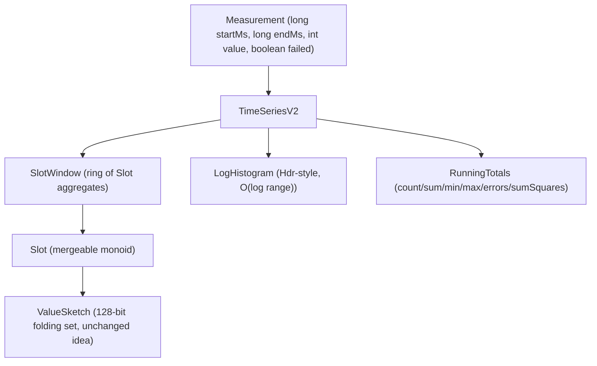

# XLT-DATA — Proposal for an Improved Time-Series Data Aggregation

**Status:** PROPOSAL — not implemented. This document describes a redesign of
the `com.xceptance.xlt.report.util` aggregation classes (`IntTimeSeries`,
`IntTimeSeriesEntry`, `RuntimeHistogram` and helpers). The current behavior,
including all verified defects (D1–D7) and quirks (Q1–Q9), is documented in
`ARCHITECTURE.md` section 10 and remains untouched by this proposal.

---

## 1. Motivation

The current design delivers on its core promise — bounded memory over an
unbounded time range — but testing and targeted experiments exposed defects
that matter for a reporting pipeline whose job is to produce *trustworthy*
numbers:

| # | Problem (verified) | Impact |
|---|---|---|
| D1 | `condense` wipes the last aggregate when the active window collapses to one slot on huge time jumps | Silent data loss |
| D2 | `addValue` crashes (`ArrayIndexOutOfBoundsException`) when a measurement starts before the window and ends far beyond its right edge | Report generation aborts |
| D3 | `DEFAULT` sentinel collides with real data at/after second 2_147_385_000 | Getters throw despite stored data |
| D4 | Negative values: entries clamp to 0, `sumOfSquares` and histogram use the raw value | mean/stddev/percentiles mutually inconsistent |
| D5 | `RuntimeHistogram` allocates O(value range / precision) ints, unbounded | `OutOfMemoryError` from two adversarial values |
| D6 | Every scalar query re-scans all slots (O(size) stream walk) | Hidden CPU cost in report loops |
| D7 | Concurrency loop steps by the scale *exponent* instead of the slot width | Concurrency gauge inflated up to 2x+ at scale >= 3 |

Plus structural issues: `int` seconds (year 2038), `merge` mutating its
argument (Q6), `equals` without `hashCode` (Q4), quantized
`getLastSecond` (Q7), a `toHistogram` whose first bucket starts at a
hardcoded 0 (Q3), and mixed responsibilities (timestamp math, window
management, statistics, and histogram ownership all in one class).

## 2. Goals / Non-Goals

**Goals**

1. Correctness first: no silent data loss, no crashes on out-of-order or
   long-spanning measurements, one consistent value policy.
2. Hard memory bound for *all* inputs, including adversarial value ranges.
3. O(1) scalar queries (count/sum/min/max/errors/stddev) at all times.
4. `long`-based time handling — no year-2038 limit.
5. Mergeable aggregates end-to-end (slot entries *and* whole series) so
   parallel/multi-file aggregation becomes a fold, with no argument mutation.
6. Keep the proven core ideas: fixed power-of-two slot array, pairwise
   OR-folding on both the time and value axes, allocation-free hot path.
7. Testability: every invariant expressible as a property (see section 8).

**Non-Goals**

- Wire-format/serialization compatibility with existing XLT reports (the
  proposal changes reconstructed-value semantics slightly; a migration
  adapter is sketched in section 9 but out of scope here).
- Sub-second time resolution (second granularity remains the reporting
  granularity; the API no longer prevents finer resolutions later).
- Thread safety *within* one instance (remains single-threaded; parallelism
  is achieved via mergeable instances, section 6.5).

## 3. Design Overview



Key changes at a glance:

| Area | Current | Proposed |
|---|---|---|
| Time base | `int` seconds, `* 0.001` | `long` millis internally, slot math in `long` seconds |
| Window | flat array + `arraycopy` shift, `firstSecond` sentinel | **ring buffer** with `baseSecond` + `headIndex`, no sentinel |
| Condense | in-place pair merge with wipe bug | pair merge over the *occupied arc only*, provably lossless |
| Value histogram | dense `int[]` over value range | **logarithmic bucket histogram** (HdrHistogram-style), O(log) memory |
| Scalar queries | O(size) re-scan per call | running totals, O(1) |
| Concurrency | loop steps by `scale` | loop steps by `slotWidth`, slot-aligned |
| Negative values | inconsistent clamping | explicit, single policy (reject by default) |
| Entry merge | mutates `this` and possibly the argument | pure function `Slot.merge(a, b) -> new Slot` + in-place variant for internal use only |
| Distinct values | 128-bit folding set | unchanged (the idea is sound), but folding extracted to a tested value type |

## 4. Core Types (Sketches)

All sketches are pseudo-Java; names are indicative.

### 4.1 Measurement and value policy

```java
public record Measurement(long startMillis, long endMillis, int value, boolean failed)
{
    public Measurement
    {
        if (endMillis < startMillis) throw new IllegalArgumentException(...);
        if (value < 0) throw new IllegalArgumentException("negative runtime: " + value);
    }
}
```

One policy instead of three (fixes D4): **negative values are rejected at the
boundary.** Callers that must tolerate garbage clamp explicitly before
calling (`Math.max(0, v)`), making the decision visible. Rationale: runtimes
are durations; a negative duration is a producer bug, and silently mixing
clamped and raw values is worse than failing fast. (Fallback option if
rejection is unacceptable in production pipelines: a constructor flag
`NegativeValuePolicy.{REJECT, CLAMP}` applied uniformly to slots, histogram,
and sum-of-squares.)

### 4.2 SlotWindow — ring buffer instead of shift+sentinel

```java
final class SlotWindow
{
    private final Slot[] slots;      // length = power of two
    private long baseSecond;         // second mapped to slots[0]; NO sentinel
    private int  scaleBits;          // slot width = 1L << scaleBits
    private int  used;               // number of occupied slots from base
    private boolean empty = true;    // replaces the DEFAULT sentinel (fixes D3)

    int indexOf(long second)         { return (int)((second - baseSecond) >>> scaleBits) & mask; }
    long secondOf(int index)         { return baseSecond + ((long)(index & mask) << scaleBits); }
}
```

- **No `arraycopy` shifting.** Late data re-bases `baseSecond` and rotates
  logically; the ring makes "shift right" an O(1) base adjustment plus
  eviction of slots that fall out of the (post-condense) covered range.
- **`empty` flag** instead of a magic second value (fixes D3 and removes the
  2037 collision entirely).
- `scaleBits` replaces `scale - 1` everywhere (removes the off-by-one
  encoding that produced D7's unit confusion).

### 4.3 addValue — total function, no crash path

```java
void add(Measurement m)
{
    long startSecond = Math.floorDiv(m.startMillis(), 1000);
    long endSecond   = Math.floorDiv(m.endMillis(),   1000);

    if (empty) { baseSecond = startSecond; empty = false; }

    // 1) re-base for early data (may evict/condense, see 4.4)
    if (startSecond < baseSecond) rebase(startSecond);

    // 2) ALWAYS ensure the full [startSecond..endSecond] span fits —
    //    both edges, not else-if (fixes D2)
    while (!fits(endSecond)) condenseOnce();

    // 3) record
    slotAt(startSecond).record(m.value(), m.failed());
    totals.add(m.value(), m.failed());
    histogram.addValue(m.value());

    // 4) concurrency: step by slot WIDTH, skip the start slot explicitly
    long w = slotWidth();
    for (long s = slotStartOf(startSecond) + w; s <= endSecond; s += w)
        slotAt(s).touchConcurrency();

    // 5) running min/max second tracking (exact, not quantized — fixes Q7)
    lastSecond = Math.max(lastSecond, endSecond);
}
```

Notes:

- Step 2 runs *after* step 1 and checks the right edge unconditionally, so
  the D2 combination (early start **and** far end) is handled: rebase first,
  then condense until the end second fits. The loop cannot spin forever
  because `condenseOnce` doubles the covered span each time and the span is
  bounded by `long`.
- Step 4 fixes D7: the loop advances by `slotWidth` seconds and starts at
  the *next slot boundary*, so each covered slot is touched exactly once and
  the start slot is never double-counted.
- `floorDiv` instead of `(int)(ms * 0.001)` — exact, overflow-free, and
  correct for pre-1970 timestamps should they ever occur.

### 4.4 condenseOnce — lossless by construction

```java
private void condenseOnce()
{
    // Merge pairs ONLY over the occupied arc [0..used), never over the
    // whole array, and never "fill" a slot that still holds data.
    int newUsed = (used + 1) >>> 1;
    for (int i = 0; i < newUsed; i++)
        slots[i] = Slot.merge(slots[2*i], safeSlot(2*i + 1));  // pure merge
    for (int i = newUsed; i < used; i++)
        slots[i] = Slot.EMPTY;
    used = newUsed;
    scaleBits++;
    // baseSecond unchanged: slot 0 still covers the same start second,
    // only its width doubled.
}
```

Fixes D1: the loop bound is derived from `used` (the occupied arc), the
merge is a pure function, and the "fill" phase only clears slots *outside*
the merged arc. The invariant `total count/sum over slots == running
totals` holds before and after every condense and is asserted in tests
(section 8). A condense can now also be expressed as
`SlotWindow -> SlotWindow`, enabling snapshot/merge workflows.

### 4.5 Slot — the mergeable monoid (rework of IntTimeSeriesEntry)

```java
public final class Slot
{
    public static final Slot EMPTY = new Slot();

    private long count, errorCount, sum;
    private int  max, min;             // NO sentinel-to-zero mapping: EMPTY
                                       // is a distinct value, getters return
                                       // OptionalInt or documented defaults
    private int  concurrency;
    private final FoldingValueSet values;  // extracted 128-bit structure

    public static Slot merge(Slot a, Slot b);   // pure — fixes Q6
    public Slot mergeInPlace(Slot other);       // package-private, for condense
}
```

- `merge` is a **static pure function**; the argument-mutating behavior
  (Q6) disappears. Scale alignment happens inside the returned
  `FoldingValueSet`, never on the caller's objects.
- `FoldingValueSet` encapsulates `low/high/scaleBits` plus
  `combineAdjacentBits`/`compressAndShiftOddBits` folding (the current
  `BitCompression` primitives — they are correct and stay). It gets a proper
  `equals`/`hashCode` and its own unit tests including the fold property
  `fold(bit i) == bit i/2`.
- `equals` is either dropped (slots are mutable state, identity semantics)
  or accompanied by `hashCode` (fixes Q4). Recommendation: make `Slot`
  immutable with copy-on-write fields for the report side, keep a mutable
  builder for the ingestion side.
- The unreachable `distinctValuesScale` equality branch (Q8) disappears
  because scale becomes a derived property of the value set, compared as
  part of `FoldingValueSet.equals`.

### 4.6 LogHistogram — replacing RuntimeHistogram

The dense `int[]` over the value range (D5) is replaced by a
**logarithmic bucket histogram** in the spirit of HdrHistogram /
Exponential Histograms:

```java
final class LogHistogram
{
    // subBucketCount = 2^subBucketBits (e.g. 128 -> ~1% relative resolution)
    // buckets laid out as [0..subBucketCount) * 2^k, k = 0..62
    private final int[] counts;          // fixed size ~ subBucketCount * 64 / 8
    private long totalCount;
    private int  minValue = Integer.MAX_VALUE, maxValue = Integer.MIN_VALUE;

    void addValue(int value);            // O(1): index = f(nlz, sub-bucket)
    double getPercentile(double p);      // walk counts, interpolate within bucket
    long getCountInRange(long from, long to);
}
```

Properties:

- **Fixed memory** (a few KB for 1% resolution over the full `int` range)
  regardless of input distribution — D5 becomes impossible by construction.
- **Relative error bound** (~1/subBucketCount) instead of the current
  *absolute* error of `precision`: large runtimes (the interesting tail!)
  keep proportionally fine resolution, small runtimes are exact down to 1
  unit with a linear first bucket group.
- Percentile reconstruction interpolates within the located bucket and can
  report the *bucket midpoint* or *upper bound* — a documented, stable
  choice instead of today's silent floor-to-bucket-base.
- `getCountInRange` keeps the contract `IntTimeSeries.toHistogram` needs,
  with the same inclusive semantics but exact bucket attribution.
- Mergeable: two histograms fold by adding counts (parallel aggregation).

The empirical-quantile definition (even case = mean of two order statistics)
is kept — it is well-understood and already differentially tested against a
sorted-array oracle; only the value reconstruction changes.

### 4.7 RunningTotals — O(1) queries (fixes D6)

```java
final class RunningTotals
{
    long count, errorCount, sum;
    long sumOfSquares;          // or Kahan/Welford accumulator, see below
    int min, max;

    void add(int value, boolean failed);
    void merge(RunningTotals other);
}
```

`TimeSeriesV2.getCount()/getTotalValue()/getErrorCount()/getMean()/
getStandardDeviation()/getStatistics()` read these fields instead of
re-scanning slots. Slots remain the source of truth for *per-time* queries
(`toHistogram`, chart series), totals for *global* scalars.

Because condense/eviction can drop slot data in extreme cases, the design
decision is explicit: **totals are never decremented** — they represent
"everything ever added", while the slot window represents "what is still
time-resolved". `getStatistics()` returns an immutable record:

```java
public record SeriesStatistics(long count, long errorCount, long sum,
                               int minValue, int maxValue, double mean,
                               double standardDeviation) {}
```

Standard deviation: replace `Math.pow(value, 2)` (slow, general-purpose)
with `(double) value * value`, and optionally use **Welford's online
algorithm** to avoid the catastrophic-cancellation failure mode of
`E[x^2] - E[x]^2` when mean and stddev differ by orders of magnitude
(e.g. values around 1_000_000 with stddev 1 currently yields garbage or
`NaN` via `sqrt` of a tiny negative number).

### 4.8 TimeSeriesV2 — public API

```java
public final class TimeSeriesV2 implements Mergeable<TimeSeriesV2>
{
    public TimeSeriesV2();                       // 4096 slots, 1s initial width
    public TimeSeriesV2(int slotCount);          // rounded up to power of two

    public void add(Measurement m);              // the only ingestion method
    public void add(long startMs, long endMs, int value, boolean failed);

    // exact scalars, O(1)
    public SeriesStatistics statistics();
    public long count();  public long errorCount();  public long totalValue();
    public double mean(); public double standardDeviation();

    // percentiles via LogHistogram
    public int percentile(double p);             // validates 0 <= p <= 100

    // time axis, exact (no quantized lastSecond — fixes Q7)
    public OptionalLong firstSecond();           // Optional instead of
    public OptionalLong lastSecond();            // IllegalStateException (fixes D3)
    public long slotWidthSeconds();

    // value distribution for reports
    public List<HistogramBucket> histogram(int bucketCount);
    // buckets tile [min..max] uniformly; FIRST bucket starts at min (fixes Q3);
    // boundaries computed in long, counts from LogHistogram.getCountInRange

    // parallel aggregation
    public TimeSeriesV2 merge(TimeSeriesV2 other);   // pure, aligns scales
}
```

Removed/renamed relative to today:

- `getValues()` (exposing the internal mutable array) is replaced by an
  iterator/snapshot API returning immutable `Slot` views — the internal
  array must not leak (today a caller can corrupt the series through it).
- The two `addValue` overloads collapse into `add(Measurement)` plus one
  convenience signature.
- `getScale()` (ambiguous, off-by-one encoded) becomes
  `slotWidthSeconds()`; the internal `scaleBits` stays private.

## 5. Correctness Rules (Invariants)

The redesign is defined by these invariants; each maps to a defect it
eliminates and becomes an executable property test:

| # | Invariant | Fixes |
|---|---|---|
| I1 | For any sequence of measurements within `long` range, `add` never throws AIOOBE and never loses count/sum: `count() == number of adds`, `totalValue() == sum of clamped values`. | D1, D2 |
| I2 | `firstSecond()/lastSecond()` are present iff at least one measurement was added, and equal the exact min/max added seconds. | D3, Q7 |
| I3 | All components (slots, histogram, totals) see the *same* value for a measurement. | D4 |
| I4 | Memory of `TimeSeriesV2` is bounded by `O(slotCount + log(valueRange))`, independent of input distribution. | D5 |
| I5 | Scalar queries are O(1) (no slot-array traversal). | D6 |
| I6 | A measurement spanning seconds `[s..e]` increments concurrency of each *slot* intersecting `(s..e]` exactly once. | D7 |
| I7 | `merge` is associative and commutative on scalars; `Slot.merge` does not mutate arguments. | Q6 |
| I8 | Condense preserves the multiset of scalar aggregates over the occupied arc. | D1 |

## 6. Performance Considerations

1. **Hot path budget** (`add`): ~10 shifts/masks, 1-2 slot updates, 1
   histogram index computation (nlz-based, branch-light), running-totals
   update. No allocation, no `Math.pow`, no streams. The current
   implementation's per-add costs that disappear: `Math.pow` (replaced by
   multiply), potential `Arrays.stream` in queries (gone), `arraycopy`
   shifts (ring buffer).
2. **Condense** stays O(occupied) but runs at most `log2(span/size)` times
   per add amortized — same as today, without the wipe bug.
3. **LogHistogram** add is O(1) with one `numberOfLeadingZeros` (JDK
   intrinsic) — likely *faster* than today's grow-by-reallocation pattern,
   which copies the whole bucket array on every range extension (a
   pathological series alternating between two distant values reallocates
   per add today).
4. **JMH benchmarks** to port from the existing `FastHashMapBenchmark`
   pattern: `add` throughput (in-window / late-data / condense-heavy),
   `percentile` latency, memory footprint via JOL, and a differential
   harness against a naive `ArrayList<Integer>` + sort oracle.
5. `BitUtil` shrinks to what is actually used (`nextHighestPowerOfTwo`, or
   direct JDK calls: `Long.bitCount`, `Integer.numberOfTrailingZeros` are
   intrinsics on all supported JVMs — the vendored Hacker's Delight
   implementations date from before Java 5/6 and should be retired or kept
   only if benchmarks show a win, which they will not).

## 7. Compatibility and Migration

- **Behavioral deltas** (must appear in release notes): percentiles of
  large values become *more* accurate (relative vs absolute bucketing);
  `histogram()` first bucket starts at `min`; `lastSecond` is exact;
  negative values are rejected (or uniformly clamped) instead of
  inconsistently handled; empty-series getters return `Optional`/records
  instead of throwing.
- **Migration path**: keep `IntTimeSeries` as a deprecated facade delegating
  to `TimeSeriesV2` with the legacy quirks re-implemented at the facade
  boundary where cheap (quantized `getLastSecond`, throwing getters,
  precision-8 floor reconstruction) until report templates are updated.
- **Data files**: the aggregation is in-memory per report run; no persisted
  format depends on bucket layouts — only rendered report values change
  (slightly different percentile/histogram numbers, all within documented
  error bounds).

## 8. Test Strategy for the New Implementation

Reuse the oracle approach that worked for the current suite:

1. **Differential/property tests** (fast, seeded): random measurement
   streams — including out-of-order, multi-second spans, huge jumps,
   duplicates — checked against a naive reference model
   (`TreeMap<second, SimpleAggregate>` + sorted list for percentiles)
   asserting I1–I8 after every operation.
2. **Invariant fuzzing** for `condenseOnce`/`rebase`: after each step,
   occupied-arc aggregates must equal running totals (I8).
3. **LogHistogram**: differential test of percentiles against sorted-array
   oracle within the documented relative error bound; memory bound test via
   JOL; adversarial ranges (0, `Integer.MAX_VALUE`, negatives if policy
   allows) must not allocate beyond the fixed footprint (I4).
4. **Merge algebra**: associativity/commutativity/purity properties (I7)
   over randomized slot pairs and whole series.
5. **Concurrency mapping** (I6): for spans crossing slot boundaries at
   every scale, assert exactly-once touches — the direct regression test
   for D7.
6. **Mutation testing** (PIT is already wired into the build) with a 100%
   mutation-score target for the window/condense logic.
7. **JMH regression gate**: `add` throughput must not regress below the
   current implementation's measured baseline.

## 9. Alternatives Considered

| Alternative | Verdict |
|---|---|
| Keep dense histogram, cap the range (clamp values to e.g. 0..1h) | Fixes OOM but silently distorts tail percentiles; log buckets dominate it in both memory and accuracy. |
| T-Digest / DDSketch instead of LogHistogram | Excellent for quantiles and mergeable, but heavier dependency and it does not serve `getCountInRange(start, end)` for report histograms naturally; LogHistogram covers both with simpler code. Revisit if accuracy demands grow. |
| Keep flat array + arraycopy, only patch the wipe/off-by-one bugs | Minimal-diff option; keeps O(size) shifting on late data, the sentinel design, and the `scale-1` encoding that caused D7. Rejected: the bug class (index/unit confusion) survives. |
| Store per-slot histograms instead of one global | Enables per-time percentiles but multiplies memory by slot count; not required by current reports. The mergeable `LogHistogram` leaves this door open. |
| Make everything immutable/persistent (structural sharing) | Elegant, but allocation pressure on the ingestion hot path contradicts the design's raison d'être. Purity is applied only where it fixes real bugs (`Slot.merge`). |

## 10. Implementation Plan (if approved)

1. `FoldingValueSet` + tests (extract, no behavior change).
2. `LogHistogram` + differential tests (standalone, replaces
   `RuntimeHistogram` usage).
3. `Slot` (pure merge) + `RunningTotals` + tests.
4. `SlotWindow` (ring, rebase, condenseOnce) + invariant fuzz tests.
5. `TimeSeriesV2` facade + differential test vs naive model + vs legacy
   `IntTimeSeries` on non-defect scenarios (results must match within
   documented precision deltas).
6. JMH benchmarks + JOL footprint comparison.
7. Deprecate `IntTimeSeries`/`RuntimeHistogram`; migrate report callers.

Each step is independently testable and mergeable; steps 1–4 do not touch
existing production classes.

## 11. Open Questions

1. Negative-value policy: reject (recommended) or configurable clamp?
   Needs a call from the pipeline owners — today's producers never emit
   negatives, but the report parser ingests third-party CSV.
2. Percentile reconstruction convention: bucket midpoint vs upper bound
   (current code effectively reports the floor). Affects SLA comparisons at
   bucket boundaries.
3. Should `TimeSeriesV2` expose per-slot percentiles (slot-local
   histograms) for future "percentile over time" charts? Cheap to add later
   given mergeability; expensive to retrofit into the memory budget if
   bolted on as a second structure.
4. Retention of `BitUtil`: retire entirely in favor of JDK intrinsics, or
   keep the popcount family for the (out-of-scope) bitset filtering code
   elsewhere in XLT that this module was vendored alongside?
