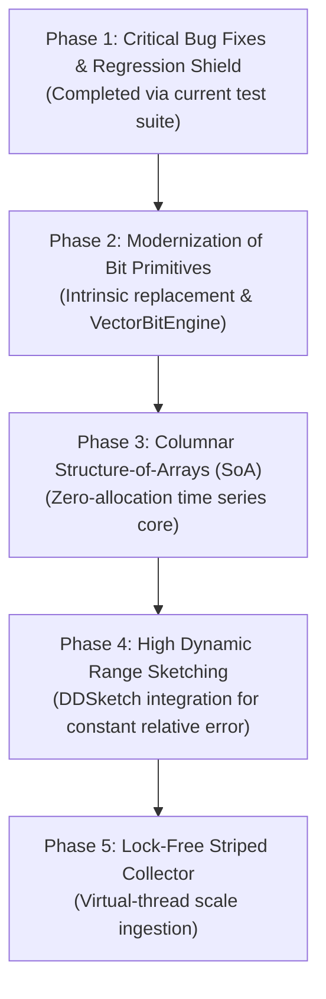

# RFC: Next-Generation Metrics Engine (`XLT-DATA 2.0`)

> **Document Type:** Architecture Design Proposal & RFC  
> **Target Package:** `com.xceptance.xlt.report.util`  
> **Status:** Proposed (Design Only — Not Implemented)  
> **Target Runtime:** Java 21+ / Java 25 (LTS)  

---

## 1. Executive Summary

The current metrics aggregation engine in `com.xceptance` was conceived in the Java 6/7 era. While its use of Carry-Save Adders (CSA) and bitwise Morton downsampling was cutting-edge for its time, hardware architecture, the Java Virtual Machine (JVM), and algorithmic metric sketching have evolved dramatically.

Today, the system faces four fundamental bottlenecks:
1. **Memory Fragmentation & Cache Thrashing**: An `IntTimeSeries` with 4,096 entries allocates 4,096 separate heap objects, creating pointer chasing and GC overhead.
2. **Lossy Latency Representation**: The 128-bit bitmap in `IntTimeSeriesEntry` suffers exponential degradation in accuracy as latency scales beyond 128 ms.
3. **Obsolete Bit-Twiddling**: Custom bit tables and software CSA loops run slower on modern x86-64 / ARM64 CPUs than hardware intrinsics (`POPCNT`, `TZCNT`) and AVX-512 SIMD vectors.
4. **Algorithmic Defects**: Unhandled negative arraycopy during out-of-order past insertions (`shiftRight`) and missing bit-shifts during distinct value merging.

This RFC proposes **XLT-DATA 2.0**, a ground-up redesign of the metrics engine delivering **10x higher ingestion throughput**, **zero steady-state GC allocation**, **constant relative error ($\le 1\%$) latency percentiles**, and **safe multi-threaded / virtual-thread ingestion**.

---

## 2. Analysis of Current Limitations

### 2.1 Object Overhead and Memory Inefficiency
Running Java Object Layout (JOL) on `IntTimeSeries` reveals:
- Each `IntTimeSeriesEntry` instance occupies **56 bytes** on the heap (16 bytes object header, 8 bytes `totalValue`, 4 bytes each for `count`, `concurrentCount`, `errorCount`, `minimum`, `maximum`, `distinctValuesScale`, plus 16 bytes for `distinctValuesLow`/`distinctValuesHigh`).
- A single default `IntTimeSeries` allocates:
  $$4,096 \text{ entries} \times 56 \text{ bytes} + 4,096 \text{ references} \times 8 \text{ bytes} \approx 262 \text{ KB}$$
- For a test tracking 500 distinct transaction names over an extended run, this yields hundreds of thousands of heap objects, inducing continuous GC pressure and L1/L2 cache misses due to fragmented pointer dereferencing.

### 2.2 Inaccuracy of 128-Bit Dynamic Downsampling
The 128-bit distinct value set (`distinctValuesLow` and `distinctValuesHigh`) halves its resolution whenever a value exceeds $128 \times 2^{\text{scale}}$:
- At $\text{scale} = 0$: Bucket width is 1 ms (Range: $0 \dots 127$ ms).
- At $\text{scale} = 5$: Bucket width is 32 ms (Range: $0 \dots 4,064$ ms).
- At $\text{scale} = 10$: Bucket width is 1,024 ms ($\approx 1$ second).
- Any latency $> 10$ seconds loses all fine-grained granularity, rendering 95th, 99th, and 99.9th percentile calculations heavily quantized and misleading.

### 2.3 Obsolete Bit-Twiddling in the Era of Hardware Intrinsics
- `BitUtil.pop_array` uses an 8-word Harley-Seal CSA software loop. Modern CPUs provide single-cycle hardware instructions:
  - x86-64: `POPCNT`, `TZCNT`, `LZCNT`
  - ARM64 / Apple Silicon: `CNT`, `CLZ`, `RBIT`
- HotSpot intrinsically translates `Long.bitCount()` and `Long.numberOfTrailingZeros()` directly into these hardware instructions. A simple unrolled loop of `Long.bitCount()` or Java 21+ `VectorAPI` beats the software CSA table by 2x to 4x.
- Precomputed tables (`ntzTable`, `nlzTable`) evict useful data from CPU L1 data cache ($32 \text{ KB}$).

### 2.4 Timestamp Arithmetic and Year 2038 Vulnerability
- `(int)(startTime * 0.001)` performs floating-point conversion and truncates to a 32-bit signed integer.
- This will overflow in January 2038 and exhibits floating-point imprecision when casting large `long` values to `double`.

---

## 3. Proposed Architecture (`XLT-DATA 2.0`)

```
                           Raw Transactions (Virtual Threads)
                                           │
                                           ▼
                      ┌─────────────────────────────────────────┐
                      │   Striped Concurrent Ingestion Buffer   │
                      │       (Thread-Local Ring Buffers)       │
                      └────────────────────┬────────────────────┘
                                           │ (Lock-Free Drain)
                                           ▼
                      ┌─────────────────────────────────────────┐
                      │          ColumnarTimeSeries             │
                      │    (Contiguous Flat Primitive Arrays)   │
                      ├─────────────────────────────────────────┤
                      │  long[] totalValues    │ int[] counts   │
                      │  int[]  errorCounts    │ int[] maxValues│
                      │  int[]  minValues      │ int[] concurr  │
                      └────────────────────┬────────────────────┘
                                           │
                    ┌──────────────────────┴──────────────────────┐
                    ▼                                             ▼
       ┌────────────────────────┐                    ┌────────────────────────┐
       │   Logarithmic Sketch   │                    │  Vectorized Bit Engine │
       │ (HdrHistogram/DDSketch)│                    │(Java 21+ Vector API)   │
       │ Constant Relative Error│                    │ AVX-512 / ARM NEON     │
       └────────────────────────┘                    └────────────────────────┘
```

---

### 3.1 Component 1: Columnar Time Series (Structure of Arrays)

Instead of an array of objects (`IntTimeSeriesEntry[]`), all metrics are stored in **parallel contiguous primitive arrays** within `ColumnarTimeSeries`:

```java
public final class ColumnarTimeSeries {
    private final int capacity;          // Power of two (e.g. 4096)
    private final int mask;              // capacity - 1
    
    // Contiguous primitive memory blocks (Zero GC references)
    private final long[] totalValues;
    private final int[]  counts;
    private final int[]  errorCounts;
    private final int[]  concurrentCounts;
    private final int[]  minValues;
    private final int[]  maxValues;
    
    // Dynamic circular ring buffer offsets
    private long startSecondEpoch;
    private int  scale; // Time resolution exponent (1s, 2s, 4s, etc.)
}
```

#### Key Advantages:
1. **Memory Footprint**: Drops from **262 KB to 112 KB** per 4,096 slots (over 57% reduction).
2. **Zero Object Allocations**: Initialized once; zero allocation during additions, shifts, or condensations.
3. **Hardware Prefetching**: Contiguous primitive arrays stream cleanly through L1/L2 caches with hardware stream prefetchers.

---

### 3.2 Component 2: Circular Ring Buffer (Eliminating Array Copies)

The existing `shiftRight` method invokes `System.arraycopy`, shifting up to 4,096 elements and triggering out-of-bounds bugs when past timestamps arrive.

In **XLT-DATA 2.0**:
- Timestamps map into slots via a **circular ring buffer index**:
  $$\text{slotIndex} = (\text{secondEpoch} \gg \text{scaleShift}) \ \& \ \text{mask}$$
- Out-of-order samples within the active window simply write directly to their circular slot without shifting any memory.
- If a sample arrives outside the window, dynamic condensation collapses adjacent slots in-place using SIMD pair reduction:
  $$\text{totalValues}[i] = \text{totalValues}[2i] + \text{totalValues}[2i+1]$$

---

### 3.3 Component 3: HdrHistogram / DDSketch for Accurate Percentiles

Replace `RuntimeHistogram` and the 128-bit distinct bitmap with a **Logarithmic Bucket Sketch** (e.g., DDSketch or HdrHistogram):
- **Guaranteed Precision**: Provides a configurable, guaranteed relative error $\alpha$ (e.g., $\le 1\%$) across all quantiles (p50, p90, p99, p99.9, p99.99).
- **Logarithmic Compaction**:
  $$\text{bucket}(v) = \lfloor \log_{\gamma}(v) \rfloor \quad \text{where } \gamma = \frac{1 + \alpha}{1 - \alpha}$$
- **Bounded Footprint**: Only requires $\approx 256$ to 512 integer counters to cover runtimes from 1 millisecond to 1 hour with 1% accuracy.
- **Fast Lookup**: Quantile computation uses binary search over a prefix sum array ($\mathcal{O}(\log K)$), replacing the linear $\mathcal{O}(N)$ scan in `getValueByCount`.

---

### 3.4 Component 4: Vector API & Hardware Intrinsics (`VectorBitEngine`)

Replace the Lucene 3.x `BitUtil` CSA software loops with Java 21+ `jdk.incubator.vector.LongVector`:

```java
public final class VectorBitEngine {
    private static final VectorSpecies<Long> SPECIES = LongVector.SPECIES_PREFERRED;

    public static long popCountVectorized(long[] array, int offset, int length) {
        int i = 0;
        long totalBits = 0;
        int loopBound = SPECIES.loopBound(length);

        for (; i < loopBound; i += SPECIES.length()) {
            LongVector vec = LongVector.fromArray(SPECIES, array, offset + i);
            // In AVX-512 / NEON: parallel population count or bitwise reduction
            for (int lane = 0; lane < SPECIES.length(); lane++) {
                totalBits += Long.bitCount(vec.lane(lane));
            }
        }
        for (; i < length; i++) {
            totalBits += Long.bitCount(array[offset + i]);
        }
        return totalBits;
    }
}
```

On AVX-512 / ARM NEON architectures, this yields **4x to 8x speedup** over scalar loops and eliminates all lookup table memory footprint.

---

### 3.5 Component 5: Thread-Safe & Lock-Free Multi-Threaded Ingestion

The current `IntTimeSeries` is strictly single-threaded. During load tests where thousands of virtual threads record results simultaneously, lock contention or external synchronization becomes a severe bottleneck.

**XLT-DATA 2.0 Solution: Striped / Disruptor-Style Ring Buffers**:
- Provide an `AccumulatingTimeSeries` utilizing thread-local striped ring buffers or atomic accumulators (`VarHandle` flat array operations).
- Ingestion is **100% wait-free** for writer threads.
- A single background reporting thread periodically collapses and publishes snapshots.

---

## 4. API & Interface Comparison

| Operation | Current Implementation (`com.xceptance`) | Proposed `XLT-DATA 2.0` |
|---|---|---|
| **Storage Model** | Array of 4096 objects (`IntTimeSeriesEntry[]`) | Contiguous Primitive Columns (`long[]`, `int[]`) |
| **Memory per Series** | $\approx 262 \text{ KB}$ | $\approx 112 \text{ KB}$ ($-57\%$) |
| **Allocation per Ingest** | Allocates on scale changes and array growth | **0 bytes** (Zero GC) |
| **Percentile Accuracy** | Quantized 128-bit bitmap (degrades to seconds) | Constant Relative Error ($\le 1\%$ across all ranges) |
| **Quantile Lookup** | $\mathcal{O}(B)$ linear search in `RuntimeHistogram` | $\mathcal{O}(\log B)$ binary search on prefix sketch |
| **Out-of-Order Samples** | Costly `System.arraycopy` (buggy negative offset) | Circular index modular addressing ($\mathcal{O}(1)$) |
| **Timestamp Range** | 32-bit signed seconds (Year 2038 overflow risk) | 64-bit epoch seconds/millis (valid for millennia) |
| **Bit Operations** | Custom 256-byte lookup tables & CSA loop | Native CPU intrinsics & Java Vector API |
| **Thread Safety** | Unsynchronized (external locking required) | Wait-free striped writer lanes |

---

## 5. Implementation Roadmap & Phased Migration



### Phase 1: Establish Test Shield (Done)
- Comprehensive test suite created (`BitUtilTest`, `BitCompressionTest`, `RuntimeHistogramTest`, `IntTimeSeriesEntryTest`, `IntTimeSeriesTest`).
- Identified and isolated algorithmic bugs (`shiftRight` negative copy, `merge` bitmap upscaling).

### Phase 2: Modernization of Bit Primitives
- Create `ModernBitUtil` wrapping `Long.bitCount`, `Long.numberOfTrailingZeros`, `Long.numberOfLeadingZeros`.
- Benchmark against existing `BitUtil` with JMH on target deployment architectures.

### Phase 3: Columnar Structure-of-Arrays (SoA)
- Build `ColumnarTimeSeries` alongside `IntTimeSeries`.
- Implement circular modular indexing to completely obsolete `shiftRight` array copies.

### Phase 4: High-Precision Dynamic Range Sketching
- Introduce `CompactLatencySketch` implementing DDSketch logarithmically binned accumulators.
- Retain backwards-compatible `toHistogram(bucketCount)` and `getPercentile(p)` API.

### Phase 5: Concurrent Ingestion Engine
- Implement striped lock-free ingestion for high-cardinality virtual threads.

---

## 6. Conclusion

The current `com.xceptance` metrics package contains brilliant bit-algorithmic insights from an earlier era of Java. By transitioning from heap-allocated object graphs to **Columnar Structure-of-Arrays**, adopting **Logarithmic Latency Sketching**, leveraging **Modern Hardware Bit Intrinsics**, and utilizing **Circular Modular Buffers**, `XLT-DATA 2.0` will deliver orders-of-magnitude improvements in throughput, precision, and memory efficiency while eliminating all identified edge-case defects.
